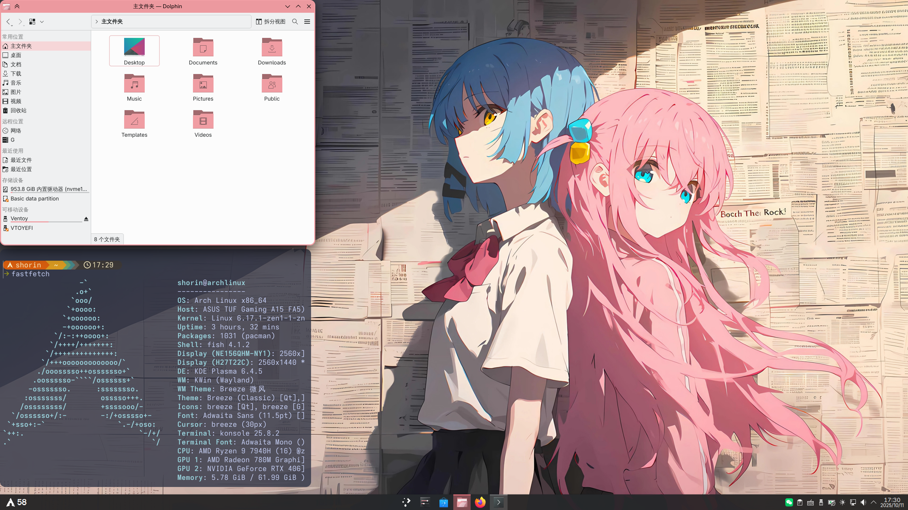
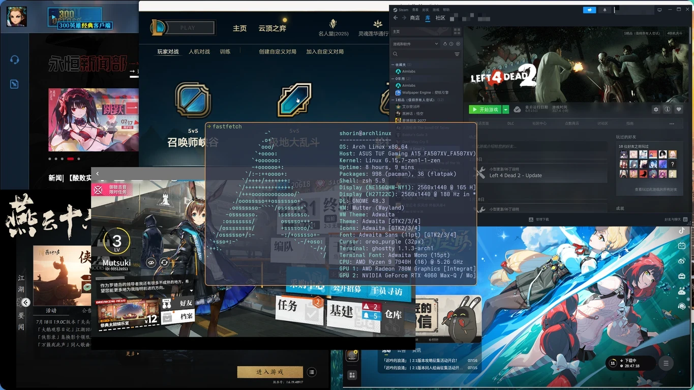
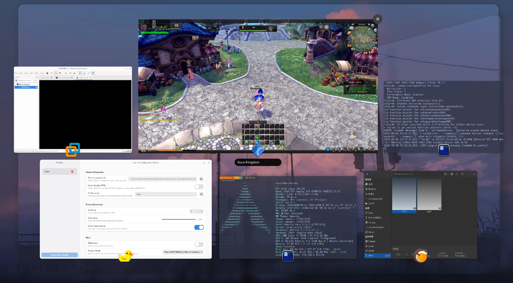
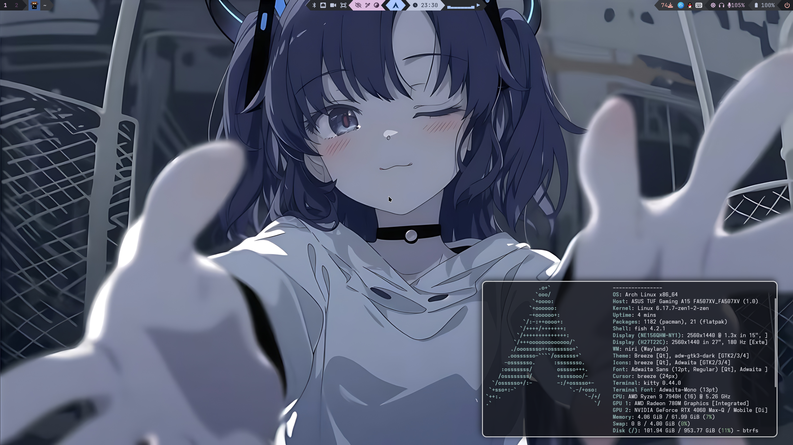
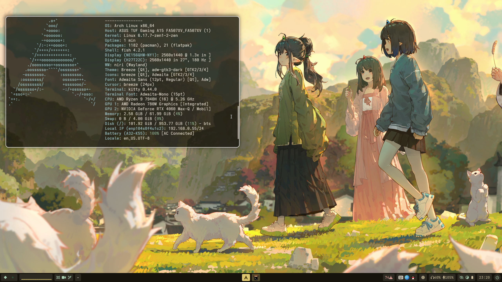
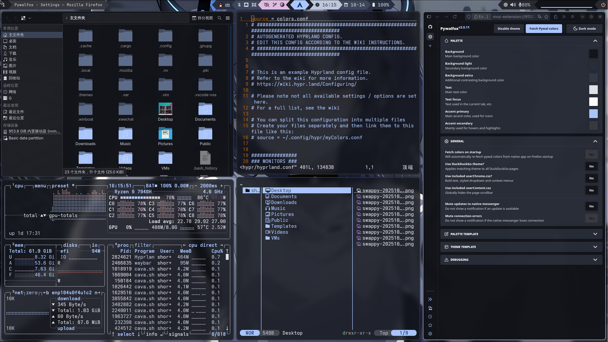
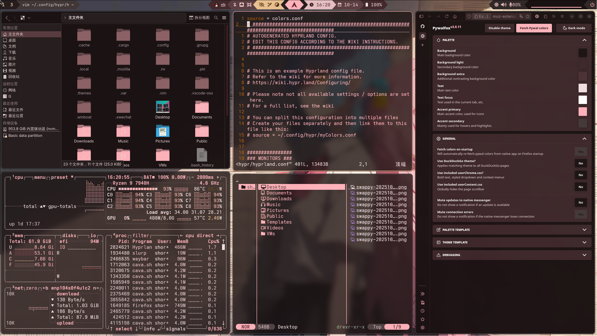

  

---

本文是我使用Archlinux的实践经历，你可以沿着我走过的路上手arch，应该会轻松很多。

使用btrfs文件系统，不涉及加密和安全启动。具体内容包括：系统的手动和脚本安装、win+linux双系统、N卡驱动和硬件编解码、GNOME和KDE Plasma桌面环境、Hyprland/Niri/Mangowc等wayland合成器、中文输入法、常用虚拟机程序（vmware、virtualbox、winapps、distrobox、qemu/kvm）、虚拟机安装windows、qemu/kvm虚拟机显卡直通、虚拟机调优和伪装、Linux玩游戏、系统性能调优等等，最后一步干净删除Linux系统。

## [Wiki-文档本体在这里](https://github.com/SHORiN-KiWATA/ShorinArchExperience-ArchlinuxGuide/wiki)

## 懒人必备：一键配置桌面环境

我的一键配置脚本做好啦，功能是用我的配置文件为刚刚安装好的archlinux系统一键安装桌面环境，具体看git仓库：https://github.com/SHORiN-KiWATA/shorin-arch-setup

## 视频

这里有一些我制作的视频，可以当作电子榨菜，也欢迎关注我的bilibili频道。

- 挑战Linux玩游戏

    [「Linux游戏指南」关于Linux玩游戏的一切](https://www.bilibili.com/video/BV1zyttzPEmp/?share_source=copy_web)

- 纯小白在禁止使用终端的情况下体验Linux

    [「女友体验Linux」 全程禁用命令行，颠覆刻板印象，纯小白也能轻松上手！](https://www.bilibili.com/video/BV1YvenzUEFf/?share_source=copy_web)

## 我折腾过的功能

-  我的KDE桌面

    

-  Linux玩游戏

    

-  小黄鸭补帧 VMware虚拟机网游单机版 wine兼容层运行旧游戏

    

- 我的第一个waybar设计

    

- 我为niri设计的类windows布局waybar

    

- 长截图脚本

    [长截图脚本.webm](https://github.com/user-attachments/assets/c387354d-9926-4580-b69d-1f5694818a2e)

    
- Niri自动设置blur版overview壁纸

    

    https://github.com/user-attachments/assets/78688d4c-eacf-4899-b833-283a745dd35a

- Niri自动切换blur壁纸
  
    [Niri自动blur背景.webm](https://github.com/user-attachments/assets/f875c7ce-e5c5-4866-a804-2f2e28214f4e)

- matugen基于壁纸生成主题颜色

    https://github.com/user-attachments/assets/85e75a2d-54ac-4aa9-8dad-c4f9145e2b02

    

    

- fastfetch老婆生成器
  
    https://github.com/user-attachments/assets/6f2af77c-a4f2-46ea-b85f-e3329a80e5fc

    
